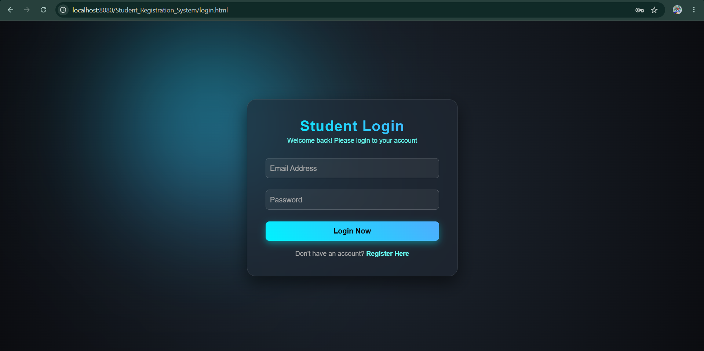
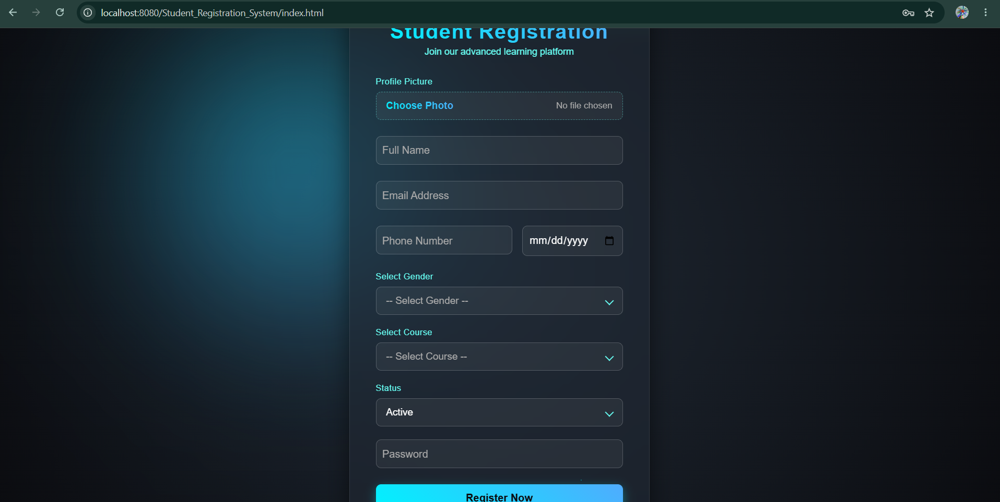
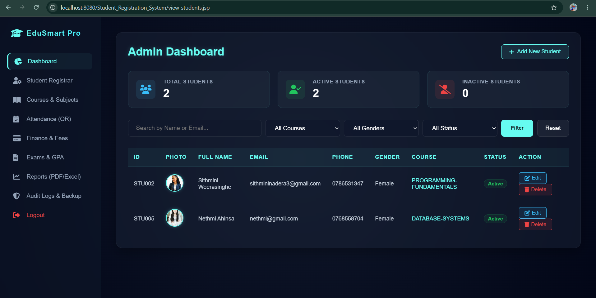
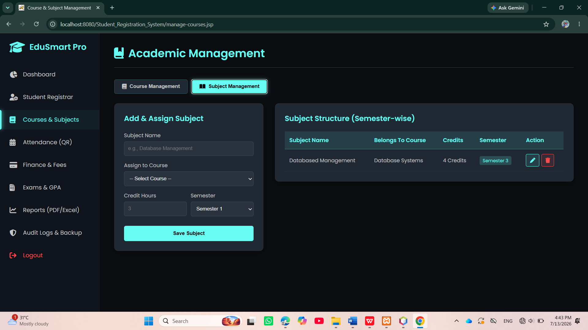
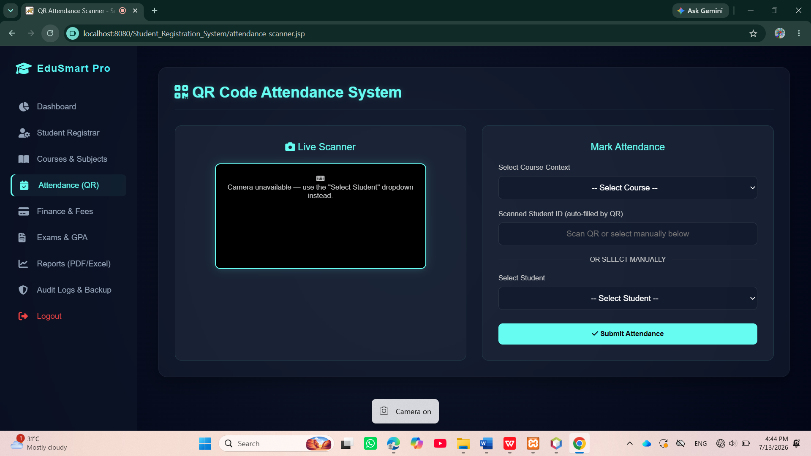
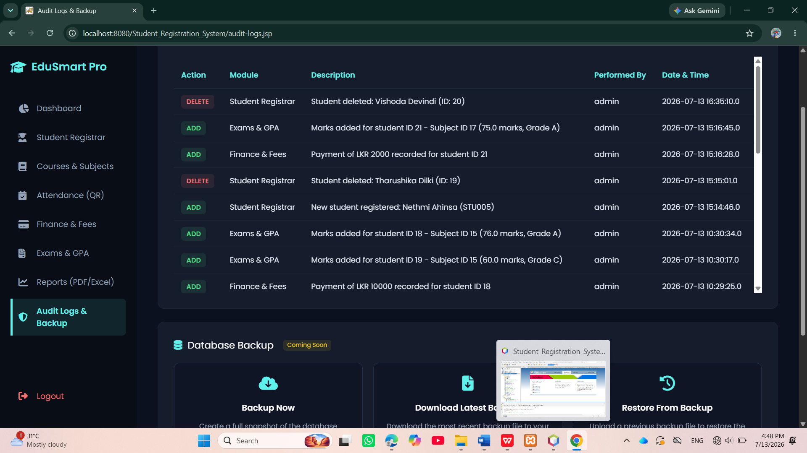

# 🎓 EduSmartPro

EduSmartPro is a Java desktop application developed using **Java**, **Swing**, **NetBeans IDE**, and **MySQL**. It is designed to simplify educational institution management by providing an efficient system for managing students, classes, courses, attendance, exams, fees, and more.

---

## ✨ Features

- 🔐 User Login & Registration
- 👨‍🎓 Student Management
- 🏫 Class Management
- 📚 Course Management
- 📅 Attendance Management
- 📝 Exam Management
- 💳 Fee Management
- 💾 Database Backup
- 📊 Admin Dashboard
- 🗄️ MySQL Database Integration

---

## 🛠️ Technologies Used

- Java
- Java Swing
- NetBeans IDE
- MySQL
- JDBC

---

## 🚀 Installation

1. Clone the repository

```bash
git clone https://github.com/Nadeera-Sithmini/EduSmartPro.git
```

2. Open the project in NetBeans IDE.

3. Create the MySQL database.

4. Import the SQL file (if available).

5. Update the database connection.

6. Run the project.

---

## 📸 Screenshots

### Login



### Register



### Admin Dashboard



### Class Management



### Course Management


### Attendance Management



### Exam Management


### Fee Management


### Database Backup



---

## 📁 Project Structure

```
EduSmartPro/
├── src/
├── screenshots/
├── build/
├── dist/
├── nbproject/
├── web/
├── build.xml
└── README.md
```

---

## 👩‍💻 Author

**Nadeera Sithmini**

GitHub: https://github.com/Nadeera-Sithmini

Repository: https://github.com/Nadeera-Sithmini/EduSmartPro

---

## 📄 License

This project was developed for educational and learning purposes.
